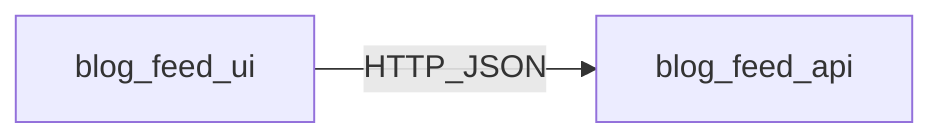

# Project summary: blog-feed

## Overview

Monorepo with **`server/`** (Express + JSON file) and **`client/`** (Vite + React) delivering a minimal blog feed: list posts and create posts with title and body.

## Features

| Feature | State | Artifacts |
|---------|-------|-----------|
| `blog-feed-api` | Done | `.sdd/state/blog-feed-api.json`, `server/` |
| `blog-feed-ui` | Done | `.sdd/state/blog-feed-ui.json`, `client/` |

## Cross-feature integration

- **Contract:** `GET` / `POST` `/api/posts` with `{ success, data }` / `{ success, error }` envelopes (see [`server/README.md`](../../../server/README.md)).
- **Development:** Root `npm run dev` runs API on port **3001** and Vite on **5173**; Vite proxies `/api` to the server.
- **Persistence:** Posts stored in [`server/data/posts.json`](../../../server/data/posts.json); creating a post from the UI appends and survives API restart.

## Validation

- `npm test -w blog-feed-server` — integration tests (happy path + validation error).
- `npm test -w blog-feed-client` — API client (MSW) + New Post form validation (RTL).
- Manual smoke: run `npm run dev`, open the app, publish a post, refresh — post remains.

## Dependency map

## Risks / follow-ups

- File-based storage is not suitable for multi-instance production without external coordination.
- Production hosting may need an explicit public API URL in the client (extend `src/lib/api.ts` with `import.meta.env`).
